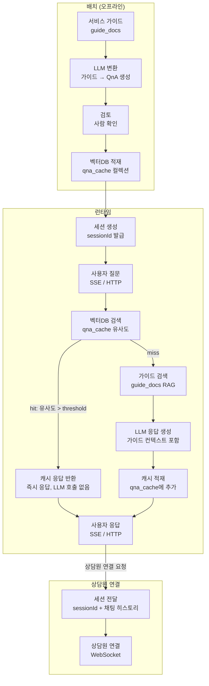

# 고객센터 챗봇 시스템

qna 및 서비스 사용 가이드 제공에 대한 챗봇 시스템

해당 시스템은 두 가지 목표를 가진다.

1. 상담사의 개입을 최소화 하여 인력 리소스 최소화
2. 직접적인 인공지능 사용을 최소화 하여 비용 리소스 최소화

최소한의 인력 및 비용 자원을 활용하여 고객에게 최상의 서비스를 제공하는 것이 본 프로젝트의 목적

---

## 유저 플로우

1. 사용자가 채팅 활성화시 프론트에서 랜덤하게 채팅 세션 id 생성
2. 상담원과 연결을 하지 않을땐 해당 채팅 세션 정보를 클라이언트에서만 관리
3. 상담원과 연결될 경우 채팅 세션 id를 기반으로 상단원(관리자 페이지에서 상담 수행)과 채팅 수행

---

## 시스템 설계

고객센터 샛봇은 두 가지 모드가 존재한다.

agent: SSE or HTTP 
real: WS

고객은 qna 또는 서비스 사용 가이드 질문을 수행한다. 

### 0. 채팅 세션 아이디 생성

상담(챗봇 또는 상담원)이 시작되면 사용자는 상담 세션 ID를 생성한다.

### 1. 질문 응답: cache layer

cache layer: [배치/관리자 작업]

```
서비스 가이드 → LLM → QnA 후보 생성 → (검토) → embedding → VectorDB 적재
```

#### 1.1 cache hit

사용자의 질문은 먼저 백터디비에 유사한 질문을 찾아 매칭 되면, 그 결과를 사용자에게 제공한다.

#### 1.2 cache miss

사용자 가이드로부터 질문에 대한 응답을 사용자에게 제공한다. 그리고 그 결과를 백터디비에 적재한다.

### 2. 상담원 연결

사용자는 상담원과 연결할 경우 상담 세션 ID과 함꼐 채팅 내역을 서버로 보낸다. 그리고 프로토콜이 WS으로 전환된다. 



하지만, 시스템이 커질수록 가이드 문서는 수정되고 추가된다. 이에 따라 문서간 의존성이 생길 수 있으며, 문서간 의존성 관리가 필요해질 수 있다. 이를 위해 llm wiki를 이용할 수 있으며, 문서가 수정되었다면 cache layer도 다시 만들어주어야 한다.

---

## Cache layer 버전 관리

가이드 문서가 수정되면 cache layer는 즉시 삭제되지 않고, 새로운 버전(version+1)으로 
QnA를 생성/검토/적재하는 동안 기존 버전이 active 상태를 유지한다.

신규 버전의 적재가 완료되면 active 버전을 전환(atomic switch)하고, 
이전 버전은 deprecated 처리 후 별도 배치로 정리한다.

이를 통해 가이드 갱신 중에도 사용자는 끊김 없이 캐시 응답을 받을 수 있다.

## 실행 가이드

### 인프라 구축

```sh
$ docker compose up
```

### llmwiki 구성

`llmwiki/raw` 적절한 문서를 추가한다.

```sh
$ cd llmwiki

$ openkb add [추가된 문서경로]
```

### qna 생성 및 질문: cache hit / miss 테스트

여기서는 편의상 openkb를 이용하여 MCP 등은 제공되지 않아 사용자가 질문을 수행할 때 llmwiki의 wiki/concept의 마크다운을 직접 참조 경로로 넣어 직접 파일을 읽도로 처리함

```sh
$ cd qna_generator

# 의존성 모듈 설치
$ uv sync

# qna 데이터 생성
# qna_candidates/v1, v2 형태로 qna 데이터 생성 후 디비에 저장
# 새로운 버전이 생성되면 기존 버전은 inactive 처리됨
$ uv run generate.py qna_candidates

# 질문 수행
$ uv run question.py

# 생성된 qna 데이터 리셋
# 디비는 초기화되지 않음
$ chmod +x ./scripts/reset.sh
$ ./scripts/reset.sh
```

API 서버를 구성한다면 generate.py 실행 후 생성된 데이터가 저장된 디비만 바라보면 된다.

```
id|source_id                                       |version|question                                  |answer                                                                                                                          |section   |embedding                                                                                                                                                                                                                                                      |status  |created_at             |
--+------------------------------------------------+-------+------------------------------------------+--------------------------------------------------------------------------------------------------------------------------------+----------+---------------------------------------------------------------------------------------------------------------------------------------------------------------------------------------------------------------------------------------------------------------+--------+-----------------------+
18|qna_candidates_concepts_주문-관리.md.json           |      1|주문을 어떻게 접수하나요?                            |고객은 상품 정보를 확인하고, 주문 내용을 기록하여 주문을 접수합니다.                                                                                         |주요 구성 요소  |[-0.265653,-0.9179311,-3.2130642,0.24323064,0.05065371,-0.6273808,0.28732058,0.12132524,-0.6479324,0.12088292,-0.4762981,1.5659496,1.3451004,0.5172579,-0.7318331,-1.2831236,-0.5945784,-1.0249482,-0.66870683,0.7297471,-0.18687317,0.3416039,-1.9980439,-1.39|inactive|2026-06-14 06:25:11.157|
19|qna_candidates_concepts_주문-관리.md.json           |      1|결제는 어떻게 진행되나요?                            |고객이 선택한 결제 수단에 따라 결제를 처리합니다.                                                                                                    |주요 구성 요소  |[-0.5665615,-0.48610434,-3.2697394,-0.32334095,0.18494208,0.52620727,0.31066465,-0.28192642,-1.0242273,-0.28624263,-0.24285963,2.0467784,1.1489756,0.027173592,0.06155785,-1.1397586,-0.8804341,-0.6968506,-0.6572963,1.3622986,-0.7158067,0.023164902,-1.74057|inactive|2026-06-14 06:25:11.157|
20|qna_candidates_concepts_주문-관리.md.json           |      1|배송 과정은 어떻게 관리하나요?                         |상품 포장, 배송 업체 선정 및 배송 추적을 담당합니다.                                                                                                 |주요 구성 요소  |[-0.52705574,-0.23612525,-2.6987536,-0.18192127,0.0022981977,0.10458152,0.08120314,0.31550372,-1.458067,-0.1990026,0.2678537,2.3287518,0.5386313,-0.1917005,0.031232003,-0.7617955,-0.9996225,-0.9375094,-1.1738214,0.58555746,-0.40915522,-0.46003568,-1.09812|inactive|2026-06-14 06:25:11.157|
21|qna_candidates_concepts_주문-관리.md.json           |      1|주문 취소는 어떻게 해야 하나요?                        |고객의 요청에 따라 주문을 취소하고 환불을 처리합니다.                                                                                                  |주요 구성 요소  |[-0.53436923,-0.6922203,-3.2929406,0.5965312,0.540562,-0.054009866,0.42271358,1.0578781,-0.95011014,-0.20537052,-0.72921616,1.496916,1.0948263,-0.28285554,-0.022997975,-0.943786,-0.3630122,-0.6840384,-0.70380795,1.2969606,-0.3288632,0.12128036,-1.6298572,|inactive|2026-06-14 06:25:11.157|
22|qna_candidates_concepts_주문-관리.md.json           |      1|반품/교환 신청은 어떻게 진행되나요?                      |상품에 문제가 있거나 고객의 변심으로 인해 반품 또는 교환이 처리됩니다.                                                                                        |주요 구성 요소  |[0.27693868,-0.79953945,-3.0461404,-0.19194478,0.7554901,-0.23237467,0.25181,0.5539854,-1.3368677,0.20740515,0.07519265,1.0650874,0.6153418,0.36197984,0.31870386,-1.0647775,-0.8789076,-1.9229541,-0.90966374,0.79485404,-0.36583313,-0.5960268,-0.9398287,-1.|inactive|2026-06-14 06:25:11.157|
23|qna_candidates_concepts_주문-관리.md.json           |      1|정확한 주문 정보는 어떻게 확인하나요?                     |주문 정보를 정확하게 처리해야 합니다.                                                                                                           |주요 고려 사항  |[-0.4801438,-0.42619047,-2.9950387,0.6837103,0.7874484,-0.1717927,0.22945482,0.52929264,-1.1926069,-0.31343606,-0.46509072,1.5769528,0.5136978,0.06790888,0.25648338,-0.9928033,-0.613289,-0.67683107,-0.6584226,0.5425598,-0.84543467,0.29558852,-1.9208747,-1|inactive|2026-06-14 06:25:11.157|
24|qna_candidates_concepts_주문-관리.md.json           |      1|주문을 신속하게 진행하는 방법은 무엇인가요?                  |주문 처리 및 배송을 신속하게 진행하여 고객 만족도를 높여야 합니다.                                                                                          |주요 고려 사항  |[-0.17283756,-0.6658005,-3.063438,0.8700873,0.1281713,-0.34691948,0.41168728,0.69729334,-0.9036165,0.037441045,-0.4586673,1.3150632,1.2228281,0.7659836,-0.6559056,-1.1602228,-1.0719553,-1.1891916,-1.0352036,0.54408413,-0.12466515,0.4820274,-1.9051626,-1.4|inactive|2026-06-14 06:25:11.157|
25|qna_candidates_concepts_주문-관리.md.json           |      1|고객에게 주문 처리 과정이 어떻게 공개되어야 하나요?             |주문 처리 과정을 고객에게 투명하게 공개해야 합니다.                                                                                                   |주요 고려 사항  |[-0.59764814,-0.33248097,-3.4543664,-0.13401586,0.37208426,0.46740457,0.6334431,0.85957474,-1.5199691,0.19097184,-0.15300444,1.2979075,0.29014045,0.021491615,0.18034068,-1.2284496,-0.6925474,-0.51878667,-0.6927481,2.035854,-0.53672284,-0.09329572,-1.27817|inactive|2026-06-14 06:25:11.157|
26|qna_candidates_concepts_주문-관리.md.json           |      1|효율적인 주문 관리 프로세스는 어떻게 운영하나요?               |주문 관리 프로세스를 효율적으로 운영하여 비용을 절감해야 합니다.                                                                                            |주요 고려 사항  |[-0.5357937,-0.14322385,-2.9933372,0.054497838,0.34834984,-0.08935205,-0.06489595,0.27037832,-1.3574945,0.19581696,0.3061456,0.90066344,0.30912444,0.3535242,-0.19185628,-1.1450768,-0.25941068,-0.62326014,-1.227711,0.7070144,-0.16574317,-0.3616369,-1.82804|inactive|2026-06-14 06:25:11.157|
27|qna_candidates_concepts_주문-관리.md.json           |      1|고객 서비스와 어떻게 관련이 있을까요?                     |주문 관리는 고객 서비스의 중요한 부분입니다.                                                                                                       |관련 개념     |[-0.7116941,0.40941167,-2.945145,-0.095894024,0.106919885,0.24396035,0.0066476343,0.06460937,-1.1419528,-0.12044478,0.50083524,2.0224414,0.25036362,0.09269999,-0.2334547,-1.0913885,-0.42738736,-0.94224954,-1.2987309,1.5596623,-0.046732523,-1.1637584,-1.20|inactive|2026-06-14 06:25:11.157|
28|qna_candidates_concepts_주문-관리.md.json           |      1|재고 관리와 주문 처리는 어떻게 연관되어 있나요?               |주문 처리와 재고 관리는 밀접하게 연관되어 있습니다.                                                                                                   |관련 개념     |[-0.4362326,-0.7260568,-3.3223538,-0.20798998,0.2399698,0.35744387,0.75472337,0.44196203,-1.4530073,0.35291487,-0.39921644,1.8954226,0.4723324,-0.03523484,-0.37038824,-0.8867133,-0.8979245,-0.901894,-0.51039547,1.5884205,-0.16497518,-0.25406042,-1.1089549|inactive|2026-06-14 06:25:11.157|
29|qna_candidates_concepts_주문-관리.md.json           |      1|물류 관리에서 배송이 어떻게 중요한가요?                    |배송 관리는 물류 관리의 핵심 요소입니다.                                                                                                         |관련 개념     |[-0.5825062,-0.69928944,-2.7803292,-0.020039558,-0.5067001,-0.32293084,-0.33369607,0.28532493,-0.93877983,-0.2594104,0.045566402,1.752802,0.45551136,0.40398428,-0.26861474,-1.0323085,-1.4305961,-1.0465091,-1.2742752,0.96858054,0.013012988,-0.46037447,-1.4|inactive|2026-06-14 06:25:11.157|
30|qna_candidates_concepts_주문-관리.md.json           |      1|회원 관리와 주문 정보는 어떻게 연결되어 있나요?               |주문 정보는 [[concepts/회원 관리]] 시스템에 저장 및 활용될 수 있습니다.                                                                                 |관련 개념     |[-0.5039405,-0.50085706,-3.1133726,0.10107628,0.6442773,0.4488044,0.40765783,0.36185083,-1.5627718,-0.0879298,0.15119384,2.065006,0.5143701,-0.17969805,-0.08328694,-0.62528205,-0.83245605,-0.6370223,-0.70579934,0.9718578,-0.60300773,0.12363377,-1.6726478,|inactive|2026-06-14 06:25:11.157|
31|qna_candidates_concepts_회원-관리.md.json           |      1|회원가입은 어떻게 해요?                             |메인 화면 우측 상단의 '회원가입' 버튼을 클릭하여 가입하는 방법이 있습니다. 비밀번호 설정 규칙에 대해 자세히 설명해드립니다.                                                         |주요 기능     |[-1.3728865,0.123256564,-3.8359327,0.057645656,0.62209934,0.5325075,0.19628873,1.5511754,-0.8305501,-0.5560236,-0.15895042,1.3917814,1.1821153,0.64849365,1.138583,-0.86676127,0.19373213,-0.5452135,-1.0403004,1.4293764,-0.4826176,-0.41685697,-1.7911232,-1.|inactive|2026-06-14 06:25:11.342|
32|qna_candidates_concepts_회원-관리.md.json           |      1|로그인이 어떻게 되나요?                             |이메일/비밀번호 기반 로그인 외에도 카카오/구글 간편 로그인도 지원합니다. 자세한 방법은 서비스 가이드를 참고해주세요.                                                              |주요 기능     |[-0.8390501,-0.5171041,-3.4119167,-0.37491637,0.47132576,-0.1830422,0.5260895,0.19959289,-1.2664272,-0.7667458,-0.52831155,2.1172473,1.1586019,0.017657198,0.18017039,-0.9426622,-1.1491494,-1.7337509,-0.34725147,0.2939589,-0.44552663,0.08400326,-0.7335932,|inactive|2026-06-14 06:25:11.342|
33|qna_candidates_concepts_회원-관리.md.json           |      1|마이페이지에서 어떻게 정보를 관리할 수 있나요?                |마이페이지를 통해 개인 정보, 배송지 정보, 쿠폰 정보 등을 관리할 수 있습니다. 자세한 방법은 서비스 가이드를 참고해주세요.                                                          |주요 기능     |[-0.13301681,-0.69675994,-2.7125607,0.21251586,-0.025239449,-0.35953653,-0.5437676,0.030428248,-0.7473254,0.47081664,0.1442225,0.95608145,0.55712295,0.4929549,0.15460534,-1.0290058,-0.89969444,-1.6474165,-1.4015915,0.6122836,0.17052338,-0.54053384,-1.3487|inactive|2026-06-14 06:25:11.342|
34|qna_candidates_concepts_회원-관리.md.json           |      1|회원 탈퇴는 어떻게 해야하나요?                         |탈퇴 사유 선택, 보유 적립금/쿠폰 소멸, 주문 내역 접근 제한 등을 안내합니다. 30일 후 재가입 가능합니다.                                                                  |주요 기능     |[-1.337134,-0.069456704,-3.9539723,0.10485359,1.0639676,0.10301378,-0.028048016,0.8786319,-1.0042771,-0.6422999,-0.59913105,1.0330786,0.8397748,-0.33836675,0.36866328,-0.7879189,0.056956086,-0.5773358,-0.93318826,0.8821983,-0.6475882,-0.0072017363,-1.9880|inactive|2026-06-14 06:25:11.342|
35|qna_candidates_concepts_회원-관리.md.json           |      1|비밀번호를 어떻게 변경하나요?                          |마이페이지에서 비밀번호 변경을 할 수 있습니다. 현재 비밀번호와 새로운 비밀번호를 입력하면 변경됩니다.                                                                       |회원 정보 관리  |[-0.5954602,-0.3688266,-2.9674394,0.42112416,0.5126893,-0.5928214,0.2071289,0.32773837,-1.3832858,-0.013370422,0.1115764,2.0251896,0.33530474,0.19361712,-0.1273914,-1.4090194,-1.6354768,-1.64239,-1.3862897,0.7753697,-1.2878383,0.7036918,-1.9574766,-1.1344|inactive|2026-06-14 06:25:11.342|
36|qna_candidates_concepts_회원-관리.md.json           |      1|개인 정보 보호는 어떻게 이루어질 것인가요?                  |비밀번호 암호화, 개인 정보 접근 권한 관리, 데이터 보안 등을 포함하여 보안 정책 및 시스템 구축이 이루어집니다.                                                                |보안        |[-0.6324145,-0.15252113,-2.8240101,0.18516155,0.2410305,0.51378,0.3382043,0.52040577,-1.5672417,-0.15491575,-0.057991154,2.0977664,0.08403689,0.08170047,0.31921545,-1.1583742,-0.80849415,-0.92325693,-0.8868585,0.92450994,-0.27631056,-0.48486626,-1.2614623|inactive|2026-06-14 06:25:11.342|
37|user_prompt                                     |      1|주문 접수 방법                                  |저희 웹사이트나 앱을 통해 편리하게 주문하실 수 있습니다. 원하시는 상품을 장바구니에 담고 결제 절차를 진행하시면 됩니다. 궁금한 점이 있으시면 언제든지 고객센터로 문의해주세요.                             |주문 및 결제 안내|[0.12739474,-0.18438777,-3.0666833,0.28745377,0.6352719,-0.5736107,0.2989658,0.006130549,-0.92957586,-0.48991057,-0.087818325,1.961112,0.112268396,-0.62011796,-0.5175949,-1.2404845,-0.5645499,-0.99548554,-0.2082955,0.61969423,0.04026065,1.1809618,-1.88577|inactive|2026-06-14 06:25:40.739|
38|qna_candidates_concepts_returns_exchange.md.json|      2|구매한 상품을 교환하려면 어떻게 해야 하나요?                 |마이페이지 > 주문내역에서 해당 상품을 선택 후 '반품/교환 신청'을 진행합니다.                                                                                   |반품 및 교환 절차|[-0.62530476,-0.16072285,-3.354383,0.42475837,0.51176286,0.2351416,0.019596437,0.7131634,-0.91484547,0.6145853,-0.4896954,0.59500617,0.2766037,0.46155125,0.588135,-1.0357926,-0.02926225,-1.1040456,-1.754736,1.0975348,-0.6221393,-0.6497714,-1.1152327,-1.94|active  |2026-06-14 06:50:58.307|
39|qna_candidates_concepts_returns_exchange.md.json|      2|교환이 필요한 경우, 어떤 사유로 신청해야 하나요?              |단순 변심, 파손/불량, 오배송 등 반품/교환 사유를 선택합니다.                                                                                            |반품 및 교환 절차|[-0.42824143,0.097144894,-3.3671956,0.44279242,0.43432197,0.1337362,-0.13787898,0.86108154,-1.1390051,0.38235134,-0.3310879,0.59307677,0.3129721,0.49681985,0.05647544,-1.3555644,-0.16839188,-0.96122706,-1.3863567,1.4479008,-0.5505356,-0.82794195,-0.904405|active  |2026-06-14 06:50:58.307|
40|qna_candidates_concepts_returns_exchange.md.json|      2|교환이 어떻게 진행되는지 궁금해요. 어떻게 신청하면 될까요?         |마이페이지 > 주문내역에서 해당 상품을 선택 후 '반품/교환 신청'을 진행합니다.                                                                                   |반품 및 교환 절차|[-0.18968892,-0.6023398,-3.4280434,0.02291323,0.18930902,0.76458544,0.3908283,0.58179665,-1.4456269,0.40120152,-0.31939775,0.8582292,0.8195738,0.14110419,-0.32002288,-0.7976203,-0.69194597,-0.91568196,-1.4092915,1.7429109,-0.63149816,-0.13392016,-1.076372|active  |2026-06-14 06:50:58.307|
41|qna_candidates_concepts_returns_exchange.md.json|      2|단순 변심으로 인한 반품은 언제까지 신청 가능인가요?             |상품 수령일로부터 7일 이내에 신청 가능합니다.                                                                                                      |신청 기간     |[-0.14816865,-0.26183128,-3.0437098,0.06214012,0.43152744,-0.55207,-0.04239765,0.99641335,-1.1763356,0.023790203,-0.30726328,1.054465,0.5395349,-0.04509472,0.26205727,-0.5617375,-1.0736356,-2.1097488,-1.185462,0.3653146,0.34306103,-0.6090364,-1.22948,-1.9|active  |2026-06-14 06:50:58.307|
42|qna_candidates_concepts_returns_exchange.md.json|      2|반품 후 환불이 어떻게 이루어지는지 궁금해요. 언제까지 반환이 처리되는가요?|결제 수단에 따라 환불 처리 기간이 상이할 수 있습니다 (1~5 영업일).                                                                                       |주의사항      |[0.045977022,-0.71000016,-2.9061952,-0.0032816234,0.5165751,-0.4151274,0.30299565,0.88012004,-1.3495771,0.037811022,-0.36279792,1.4744769,0.14777273,0.16761169,0.5019362,-0.97997636,-1.0937252,-1.6972727,-1.0370483,0.7776751,-0.502294,-0.26581895,-0.88579|active  |2026-06-14 06:50:58.307|
43|qna_candidates_concepts_returns_exchange.md.json|      2|상품을 교환하는데 필요한 단계는 어떤 것인가요?                |1. 신청, 2. 사유 선택, 3. 증거 자료 첨부, 4. 수거, 5. 검수 및 처리                                                                                 |반품 및 교환 절차|[-0.0060001,-0.06535355,-3.4764042,0.18660043,0.37933198,-0.06747213,0.43587014,0.21453725,-1.0512949,-0.061743528,-0.5096875,0.6769545,0.24988921,0.42135802,0.19012015,-1.229591,-0.33734044,-1.6043868,-0.99239314,0.56500983,0.14617682,-1.4162905,-1.36717|active  |2026-06-14 06:50:58.307|
44|qna_candidates_concepts_returns_exchange.md.json|      2|반품 신청을 어떻게 하면 됨?                          |마이페이지 > 주문내역에서 해당 상품을 선택 후 '반품/교환 신청'을 진행합니다.                                                                                   |반품 및 교환 절차|[0.17969903,-0.39017954,-3.4962685,0.3629278,0.70895255,-0.19029994,0.4980114,1.275725,-1.2042269,-0.382997,0.15537035,0.9151401,0.6107692,-0.38564885,0.27029556,-0.6021099,-0.6190106,-1.87581,-0.80386275,0.6944929,-0.62478226,0.24538773,-1.9626731,-1.905|active  |2026-06-14 06:50:58.307|
45|qna_candidates_concepts_returns_exchange.md.json|      2|단순 변심으로 인한 반품은 어떻게 처리되는가요?                |사용자의 요청에 따라 고객이 직접 발송하거나 택배사가 수거합니다.                                                                                            |반품 및 교환 절차|[0.13300484,-0.62833834,-3.1731033,-0.36953261,0.42246345,-0.62107015,0.080027096,0.99930686,-0.95504886,-0.07255763,-0.43615988,1.2416738,0.61632204,-0.12178814,0.32182646,-0.56849545,-1.5463749,-2.090764,-0.8887674,0.43449426,0.18877947,-0.33666167,-1.1|active  |2026-06-14 06:50:58.307|
46|qna_candidates_concepts_membership.md.json      |      2|회원 가입을 어떻게 진행할 수 있나요?                     |[[summaries/service_guide_v1]]에 따르면 회원 가입 시 이메일 인증과 안전한 비밀번호 설정(영문, 숫자, 특수문자 포함 8자 이상)이 필요합니다. 카카오/구글 간편로그인도 지원하여 사용자 편의성을 높입니다.|주요 특징     |[-0.8768519,-0.4258791,-3.3008358,0.40113455,0.16330633,0.52390254,0.25989676,0.9244467,-1.160095,-0.038443923,-0.4610378,1.7223625,1.0689977,0.3614608,0.17792894,-0.7998625,-0.10761839,-0.60570353,-1.0003242,1.2610466,0.08251162,-0.8564421,-1.3646296,-1.|active  |2026-06-14 06:50:58.471|
47|qna_candidates_concepts_membership.md.json      |      2|회원 가입 시 필요한 정보는 무엇인가요?                    |[[summaries/service_guide_v1]]에 따르면 회원 가입 시 이메일 인증과 안전한 비밀번호 설정(영문, 숫자, 특수문자 포함 8자 이상)이 필요합니다. 카카오/구글 간편로그인도 지원하여 사용자 편의성을 높입니다.|주요 특징     |[-0.50412554,-0.5847469,-3.0574045,0.5599245,0.30429086,0.16123143,-0.05550347,0.45839798,-1.1145482,-0.3955011,-0.106787205,0.9445645,0.60309637,0.5951889,0.1937564,-0.9429518,-0.44119468,-1.0390455,-1.2032695,0.88332474,0.041853387,-0.6389041,-1.3158431|active  |2026-06-14 06:50:58.471|
48|qna_candidates_concepts_membership.md.json      |      2|회원 가입을 위한 비밀번호는 어떻게 설정해야 하나요?             |[[summaries/service_guide_v1]]에 따르면 회원 가입 시 이메일 인증과 안전한 비밀번호 설정(영문, 숫자, 특수문자 포함 8자 이상)이 필요합니다. 카카오/구글 간편로그인도 지원하여 사용자 편의성을 높입니다.|주요 특징     |[-0.8046377,-0.26946098,-3.1241121,0.94609463,0.3514285,0.5484469,0.60972905,1.0705575,-1.3708919,0.11565186,-0.21459511,1.3257393,0.7182433,0.110922724,-0.088253625,-0.8376058,-0.670656,-0.664251,-1.3637031,0.8204411,-0.77013046,0.13637397,-1.3559874,-1.|active  |2026-06-14 06:50:58.471|
49|qna_candidates_concepts_membership.md.json      |      2|회원 탈퇴 시 적립금과 쿠폰이 어떻게 처리되나요?               |[[summaries/service_guide_v1]]에 따르면, 회원 탈퇴 시 보유 적립금 및 쿠폰은 소멸되며, 주문 내역 접근이 제한됩니다. 진행 중인 주문이 있는 경우, 먼저 처리해야 탈퇴가 가능합니다.            |주요 특징     |[-0.13071634,-0.50524455,-3.772987,-0.003566063,0.5262682,-0.399056,0.4524925,1.0722119,-1.3144804,-0.058189362,-0.8327916,0.61966425,0.39375472,-0.08094615,0.028651847,-1.0583264,-0.11785213,-1.1666651,-0.531616,1.1312828,0.023974583,-0.5833243,-1.125729|active  |2026-06-14 06:50:58.471|
50|qna_candidates_concepts_membership.md.json      |      2|회원 탈퇴 후 이전의 주문 내역에 대한 접근 권한은 어떻게 변경되나요?   |[[summaries/service_guide_v1]]에 따르면, 회원 탈퇴 시 보유 적립금 및 쿠폰은 소멸되며, 주문 내역 접근이 제한됩니다. 진행 중인 주문이 있는 경우, 먼저 처리해야 탈퇴가 가능합니다.            |주요 특징     |[-0.64732313,-0.498455,-3.9392676,0.2063658,0.57061213,0.13852076,0.3826424,0.48351315,-1.866725,-0.39877266,-1.0210994,1.1646732,0.5641485,-0.095633835,-0.16842723,-0.9242174,-0.7478368,-0.79527324,-0.89972854,0.7608071,-0.33143714,0.4399022,-1.2221158,-|active  |2026-06-14 06:50:58.471|
51|qna_candidates_concepts_membership.md.json      |      2|회원 탈퇴 시 보유하는 적립금과 쿠폰은 언제 소멸되나요?           |[[summaries/service_guide_v1]]에 따르면, 회원 탈퇴 시 보유 적립금 및 쿠폰은 소멸되며, 주문 내역 접근이 제한됩니다. 진행 중인 주문이 있는 경우, 먼저 처리해야 탈퇴가 가능합니다.            |주요 특징     |[-0.26842368,-0.44167694,-3.5513203,0.5547684,0.42800012,-0.44054815,0.23979276,1.1028858,-1.2224565,-0.17507856,-0.65627605,0.35001206,0.49166062,0.2692979,-0.14513922,-1.0672953,-0.4158967,-1.1719929,-0.73917776,0.7046304,-0.32313633,-0.059510514,-1.390|active  |2026-06-14 06:50:58.471|
```